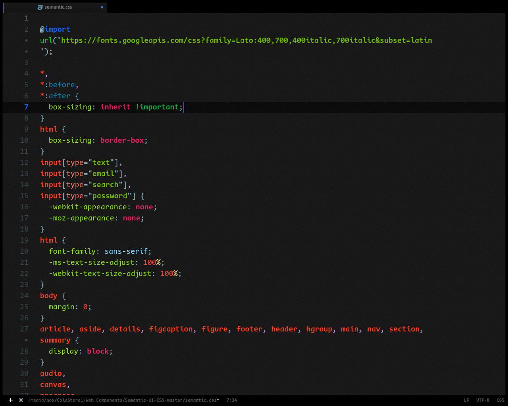
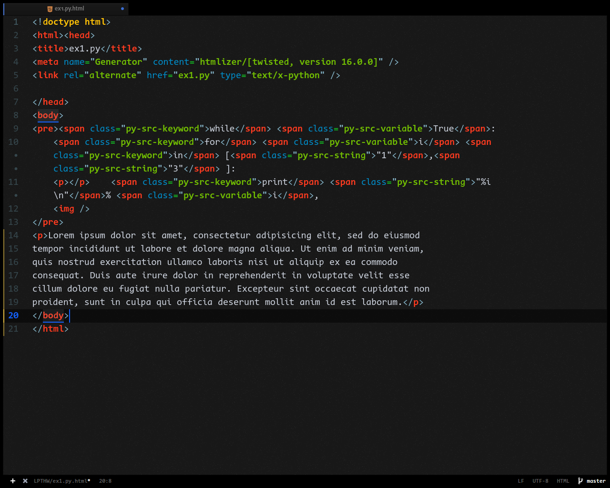
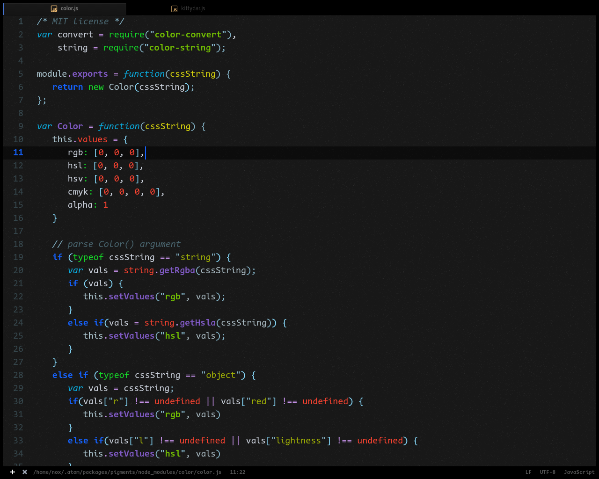
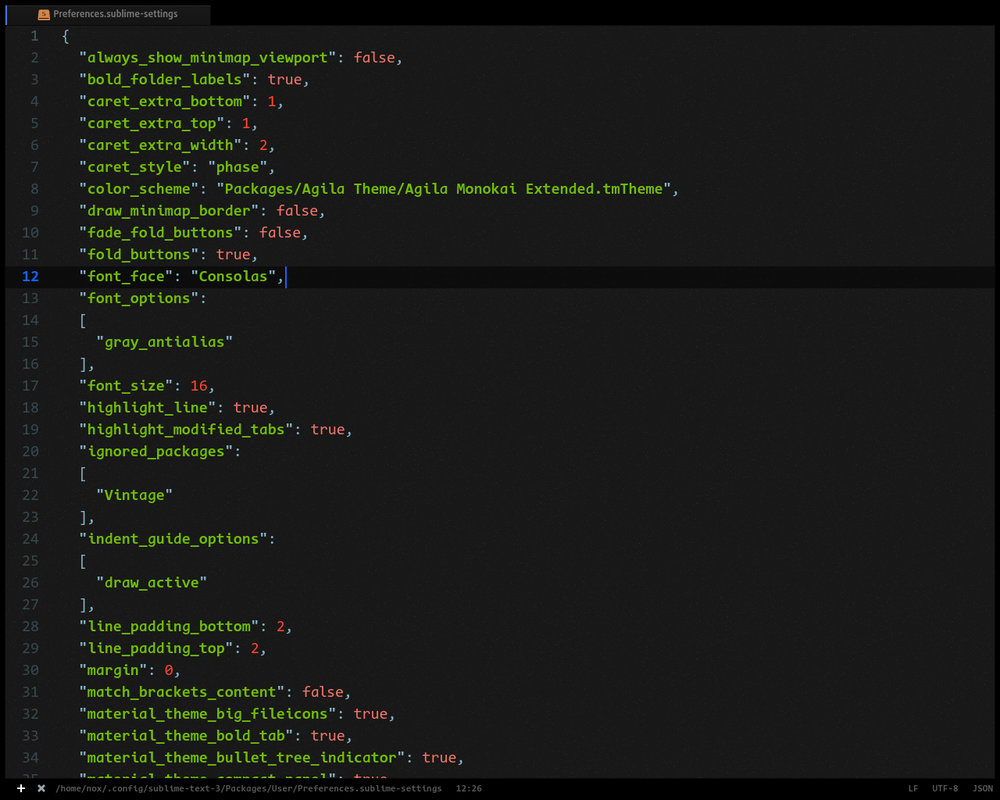
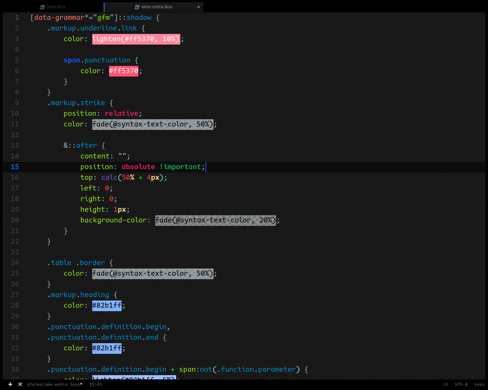
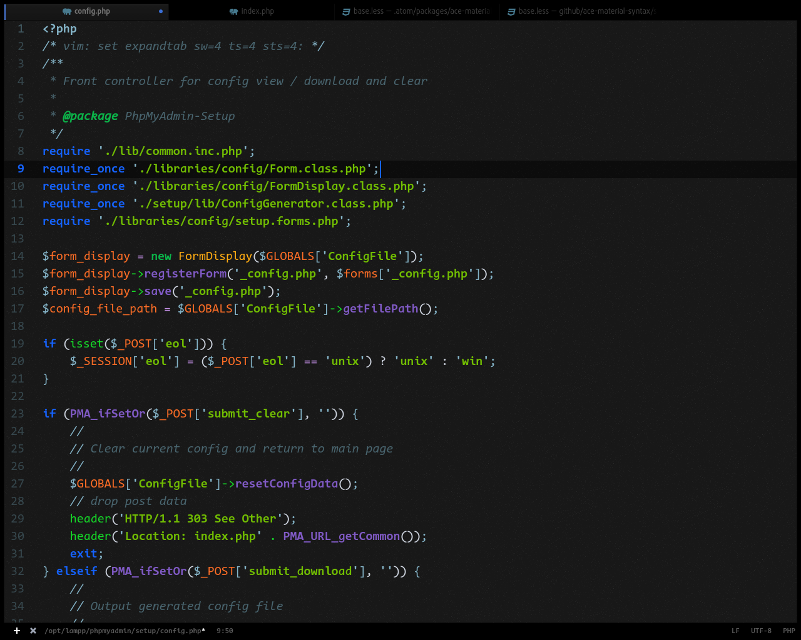
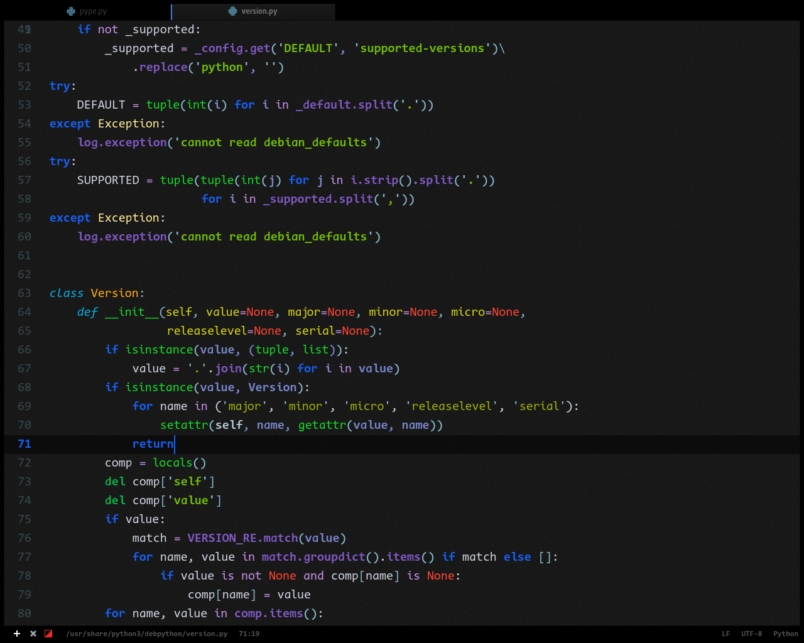

# ace-material-syntax

A customized version of [Atom Material Syntax](https://github.com/atom-material/atom-material-syntax-dark) that looks pretty natural and you never tire looking at your screen.[the background feels so easy on eyes.]
## In Screenshots:
**UI theme:** Atom-One-Dark

**Font:** Code New Roman

# C

# CSS

# HTML

# JS

# JSON

# LESS

# PHP

# PYTHON

